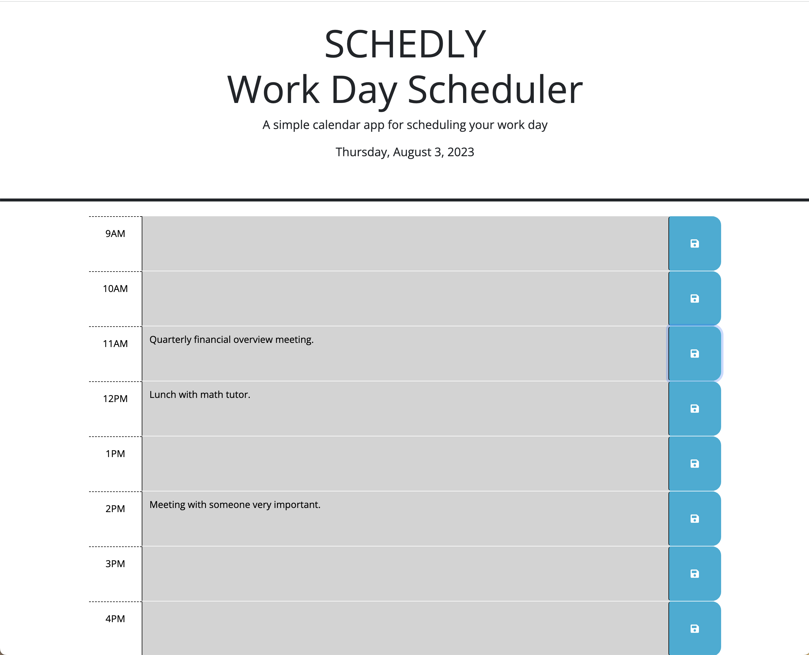
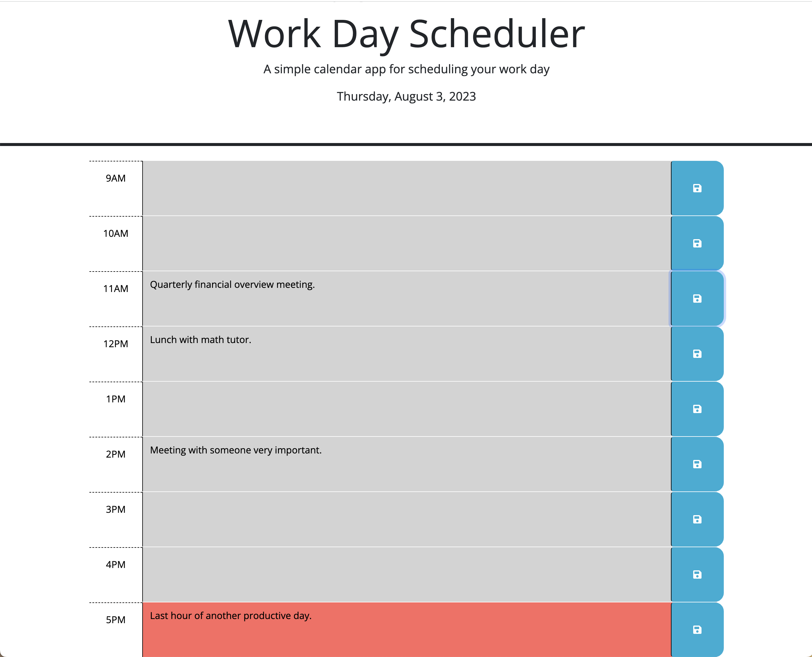

# Schedly: 
Third Party API Workday Scheduler
## Description

"Schedly" is a web based workday planner that allows the user to view their planner when they start their workday.  The hours color coded to make it easy to see.  The user can enter their hourly plans, modify them and save to have it all be retained with page refreshes.  

To achieve this , I modified the exsisting html and css file and added a new js file to create a workday scheduler using third party APIs.  
The web hosted scheduler displays the working hours of the day, color coded to represent past, present and future hours 
compared to the current time.  The planner allows the user to add their plans and save them and view them upon refreshing the page.  

This is especially useful if one's workday consists mostly of being on the computer.  Having your daily planner right there in a 
tab, easy to see, read and modify.  

 
## Table of Contents 

- [Installation](#installation)
- [Usage](#usage)
- [Credits](#credits)
- [License](#license)

## Installation

There is no installation required for this project. Please use the link in the usage section (below) to view the workday planner. 

## Usage

https://sharareh18.github.io/Schedly/

## Credits

Online Tutorials and Resources:

-  Window Local Storage: https://www.w3schools.com/jsref/prop_win_localstorage.asp

-  How to change a button text on click using localStorage in Javascript ?:   https://www.geeksforgeeks.org/how-to-change-a-button-text-on-click-using-localstorage-in-javascript/

-  How to Store Data in Local Storage - JavaScript:  https://blog.teamtreehouse.com/storing-data-on-the-client-with-localstorage#:~:text=To%20store%20data%20in%20LocalStorage%2C%20you%20use%20the%20setItem(),name'%2C%20'Matt%20West')%3B

-Dayjs : https://day.js.org/docs/en/installation/browser

-How to populate an HTML input field from HTML LocalStorage: https://stackoverflow.com/questions/40598081/how-to-populate-an-html-input-field-from-html-localstorage

-  Difference between $(this) and ‘this’ in jQuery:  https://www.geeksforgeeks.org/difference-between-this-and-this-in-jquery/amp/

-Working With Dates And Times With Day.Js:  https://blog.openreplay.com/working-with-dates-and-times-with-day-js/  

-JQuery Cheatsheet: https://htmlcheatsheet.com/jquery/

-  Professional README Guide by edX Boot Camps LLC:  https://coding-boot-camp.github.io/full-stack/github/professional-readme-guide
   I copied and used the template they provided for my README, eliminating parts that did not apply.
  

University of California Irvine Full Stack Development Bootcamp 2023 Resources:

-  UCI Web Development office hours:  Instructor Logan Garland and TA David Cox
-  UCI Web Development Student Activities: Module 5 (mini project & student activities: 7, 8, 21-26).
   
   
    
## License

NA
